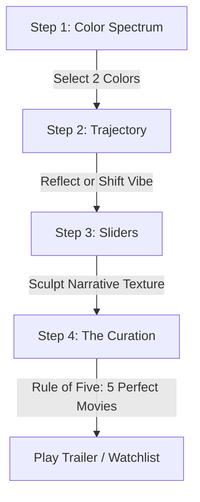

# Netflix De-Syndrome

> **Mindful, mood-first movie discovery designed to eliminate choice paralysis and streaming fatigue.**
> 
> *Pick your vibe. Get exactly five calibrated films. Stop scrolling.*

---

## Project Overview

**Netflix De-Syndrome** is a premium, minimalist web application built to solve one of the most pervasive digital challenges of our time: the endless scroll. Modern streaming platforms are engineered to maximize scrolling engagement, overwhelming users with thousands of tiles and algorithmic suggestions. 

By applying **Hick's Law** of cognitive science, Netflix De-Syndrome turns media selection into a rapid, intentional ritual. Calibrate your emotional spectrum in under 60 seconds, and receive exactly **five highly-calibrated, high-acclaim recommendations**. No endless grids. No scrolling. Just five movies, trailers, and where to watch them.

---

## The Problem: Choice Paralysis

Traditional streaming interfaces suffer from the **paradox of choice**. The human brain experiences cognitive fatigue when presented with too many parameters (choice overload). The result is the "Netflix Syndrome": spending 45 minutes browsing categories, reading synopses, and watching clips, only to end up too tired to watch anything at all.

## The Solution: Mindful Curation

Netflix De-Syndrome flips the paradigm by shifting the discovery parameters from convention (dry checkboxes like "Action, PG-13, 2018") to **narrative texture and emotional resonance**:
1. **Mood Selection**: Pairing abstract color spectrums with emotional tags.
2. **Trajectory Control**: Choosing whether to lean into a feeling (*Reflect*) or steer it (*Shift*).
3. **Sculpting Narrative Details**: Defining pace, tone, complexity, and stakes on highly descriptive aesthetic sliders.
4. **The Rule of Five**: Restricting outputs to exactly five calibrated recommendations to ensure rapid decision-making.

---

## The Core Flow in 4 Steps

Our progress-tracked wizard guides the user through a cohesive emotional calibration:



1. **Step 1: Mood Spectrum (Colors)**: Select exactly two colors that mirror your current emotional headspace (e.g. *Deep Blue* for reflective/cerebral notes, *Warm Amber* for cozy/hopeful notes).
2. **Step 2: Cinematic Trajectory**: Decide if you want to **Echo Your Vibe** (validation and catharsis by mirroring your current state) or **Pivot Your Vibe** (gently steer your mood to a new frequency).
3. **Step 3: Narrative Texturing**: Fine-tune four sliders with real-time, highly descriptive cues:
   * **Pace**: *Deliberate / Slow-Burn* vs. *Dynamic / High-Tempo*
   * **Tone**: *Visceral / Shadowed* vs. *Luminous / Uplifting*
   * **Complexity**: *Direct / Uncomplicated* vs. *Intricate / Mind-Bending*
   * **Intensity**: *Subtle / Low-Stakes* vs. *Profound / High-Stakes*
4. **Step 4: The Rule of Five**: Bypasses the endless scroll instantly, rendering exactly five highly-relevant, critically-acclaimed films complete with watch providers, YouTube trailers, and analytical match reasons.

---

## Key Premium Features

* **Vibe Signature Dashboard**: A stunning, compact header widget displaying your active spectrum colors, trajectory direction, and narrative texture details using glowing parameter badges and abstract icons.
* **Vertically Split MovieCards**: Engineered for scanability and contrast. Framed poster art sits on top of a highly legible, structured glassmorphic container detailing release metadata, curation match chips, and clamped reasons.
* **Tactile Watchlist Drawer**: A local mini-watchlist (`localStorage`) that slides in smoothly. Features Framer Motion layout collapses when unbookmarking, YouTube trailer triggers, and responsive mobile-adaptation.
* **Why This Matched Analytical Chips**: Displays specific reasons for matching categorized into indicators (Mood, Pace, Tone, Complexity, Intensity, and TMDB Ratings).
* **Dynamic Query Relaxation Engine**: The backend (Next.js server-side API) relaxes filtering criteria dynamically across multiple decades if your sliders are highly unique, guaranteeing a robust "Rule of Five" response.
* **Seed Curation ("Explore More Like This")**: Recalibrate the entire selection using a single movie as an anchor seed, matching directors, keywords, and narrative tones.
* **Show Me Alternatives (Fresh Draw)**: Requests a new batch of 5 movies while strictly avoiding titles recommended in the current session.

---

## Design & Aesthetic Philosophy

Netflix De-Syndrome features an ultra-premium, dark **Glassmorphic design system**:
* **Fluid Background Glows**: Built with custom CSS radial gradients that drift slowly behind the page (`cinematic-drift`), changing core hues based on the user's active colors.
* **Glassmorphic Materiality**: Utilizes custom CSS frosted borders, high-blur glass containers (`backdrop-filter`), and inner shadows to catch screen light.
* **Tactile Interactions**: Tactile buttons scale down slightly on tap and glow dynamically on hover based on the active mood theme colors.

---

## Technical Stack

* **Framework**: Next.js 16.2.6 (App Router & Turbopack)
* **Core Logic**: React 19.2.4 Hooks (`useState`, `useMemo`, `useEffect`)
* **Styling**: Tailwind CSS v4 & Vanilla CSS custom modules
* **Animations**: Framer Motion 12.40.0 (Step wizard exits, Watchlist layout triggers, overlay slides)
* **Icons**: Lucide React 1.16.0
* **Data Core**: TMDB REST API & Local Curation Database

---

## Local Setup & Environment

### 1. Requirements & Keys
To connect to the live movie databases, you will need credentials from **The Movie Database (TMDB)**.

Create a `.env.local` file in the root directory:
```bash
# Duplicate example file
cp .env.example .env.local
```

Open `.env.local` and add either your Access Token (Recommended) or API Key:
```env
# Recommended (TMDB v4 Read Access Token)
TMDB_ACCESS_TOKEN=your_tmdb_read_access_token_here

# Alternative (TMDB v3 API Key)
TMDB_API_KEY=your_tmdb_api_key_here
```

### 2. Run the Development Server
Install dependencies and run the local compiler:
```bash
# Install NPM modules
npm install

# Run the Turbopack dev server
npm run dev
```
Open [http://localhost:3000](http://localhost:3000) in your web browser.

---

## Offline Fallback Engine

> [!TIP]
> **Reliability Feature: Offline Continuity**
> The live TMDB service is preferred, but the experience is designed to keep working if the live request fails.

If no environment keys are present, or if the live movie request fails, the application can use a custom **Offline Matching Engine** (`src/offlinePool.ts`):
* **The Engine**: Houses a local curation database of hand-selected, highly diverse cinematic masterpieces representing all quadrants of the narrative spectrum.
* **Weighted Matching**: Translates your selected colors, vibe direction, and narrative sliders to filter the offline pool, calculating precise match percentages and reasons.
* **Seamless Fallback**: If a live TMDB connection is active but encounters network latency (exceeding **7 seconds**), a friendly alert banner slides down letting you instantly trigger the Offline Matching Engine with a single click.

---

## Codex & AI Collaboration

This project was developed in close, iterative pair-programming collaboration with **Codex**, focusing on:
1. **Interactive Glassmorphic Materiality**: Designing responsive CSS rules, hardware-accelerated animations, and Framer Motion layouts.
2. **Server-Side Relaxation Algorithms**: Designing Next.js route structures that relax filtering constraints dynamically to guarantee exactly 5 matches.
3. **Quality & Linter Compliance**: Refining TypeScript types, securing SSR hydration wrappers, and resolving effect dependencies to ensure a 100% warning-free build.
4. **Latency Fallbacks & Bookmarking**: Architecting the offline matching algorithms, timeout trigger effects, and local localStorage watchlists.

